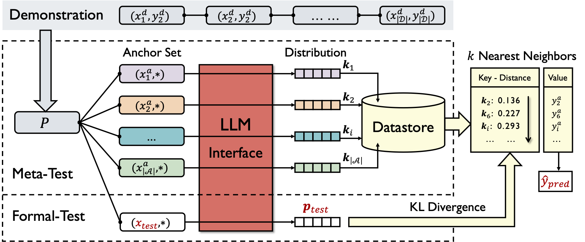

# KNNPrompting
Released code for our ICLR23 paper: [KNN Prompting: Beyond-Context Learning with Calibration-Free Nearest Neighbor Inference](https://openreview.net/forum?id=fe2S7736sNS)

<div  align="center">  

</div>  

## Preparation
### Environment
The code is tested under torch==1.12.0 and transformers==4.20.1, though the requirement of spefic version is not very strict, run with no bugs, then you are set.
### Model
Prepare your LLM ([gpt2](https://huggingface.co/gpt2-xl/tree/main) or opt) in `./llm/`, I personally prefer download them myself and configure the local path in scripts.
### Data
[Download](https://drive.google.com/file/d/1Yh2blPkJvMtdm5xWKoHr2fLp2i2Bn5Ir/view?usp=share_link) dataset and unzip them in `./data`.\
The structure of the project looks like:
```
.
├── run_icl.sh
├── run_knnprompting.sh
├── icl.py
├── knn_prompting.py
├── utils
│   ├── anchor.py
│   ├── dataset.py
│   ├── __init__.py
│   └── template.py
├── llm
│   └── gpt2-xl
│       ├── config.json
│       ├── merges.txt
│       ├── pytorch_model.bin
│       ├── tokenizer.json
│       └── vocab.json
└── data
    └── sst2
        ├── dev_subsample.jsonl
        ├── test.jsonl
        └── train.jsonl
```

## Run
Run kNNPrompting or In-Context Learning as follows, check the configuration in the script including dataset, llm, seed, etc.
```
bash run_knnprompting.sh
```
or
```
bash run_icl.sh
```
## Results
As the entire framework is training-free, you shall get **exact** results w.r.t. random seeds as follows (invariant to different environment):

| Seed                                | 1      | 2      | 3      | 4      | 5      |
| ----------------------------------- | ------ | ------ | ------ | ------ | ------ |
| **In-Context Learning** (gpt2-xl)   | 0.8438 | 0.8125 | 0.7227 | 0.8633 | 0.8242 |
| **KNN Prompting** (gpt2-xl, N=1024) | 0.8711 | 0.8867 | 0.8906 | 0.8711 | 0.8906 |

Full results are listed in the paper (see Table 8 and others).

## Citation
 * If you have any quesitons, feel free to open an issue.
 * If you find this repo useful, please cite us as:
```
@inproceedings{
xu2023knn,
title={\$k\${NN} Prompting: Beyond-Context Learning with Calibration-Free Nearest Neighbor Inference},
author={Benfeng Xu and Quan Wang and Zhendong Mao and Yajuan Lyu and Qiaoqiao She and Yongdong Zhang},
booktitle={The Eleventh International Conference on Learning Representations },
year={2023},
url={https://openreview.net/forum?id=fe2S7736sNS}
}
```